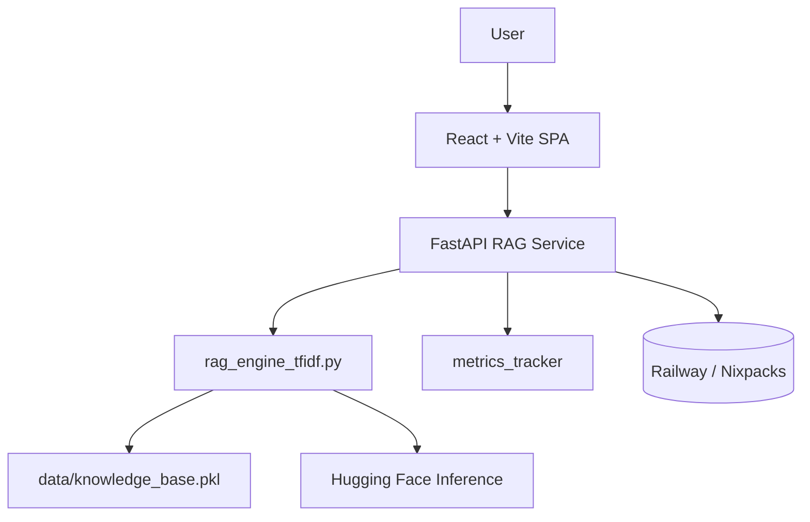

# 🎫 AI Ticket Resolution System & RAG Service

[](#) [](#) [](#) [](#license)

An end-to-end Retrieval-Augmented Generation (RAG) platform that helps IT teams resolve tickets faster with a TF-IDF knowledge base, Hugging Face AI assist, and a TypeScript/React dashboard ready for Railway deployment.

---

## 📚 Table of Contents

1. [Why this project](#-why-this-project)
2. [Key capabilities](#-key-capabilities)
3. [Architecture & repo layout](#-architecture--repo-layout)
4. [Quick start](#-quick-start)
5. [Knowledge base workflow](#-knowledge-base-workflow)
6. [Environment variables](#-environment-variables)
7. [API reference](#-api-reference)
8. [Testing & quality](#-testing--quality)
9. [Deployment to Railway](#-deployment-to-railway)
10. [Monitoring & metrics](#-monitoring--metrics)
11. [Troubleshooting](#-troubleshooting)
12. [Contributing](#-contributing)
13. [Roadmap](#-roadmap)
14. [License & acknowledgements](#-license)

---

## 💡 Why this project

IT helpdesks are drowning in repetitive tickets. This repository demonstrates how to combine TF-IDF retrieval, lightweight AI generation, and a modern UX to unlock automated, auditable recommendations while keeping humans in the loop. It runs locally, on Railway, or anywhere Docker/Nixpacks is available.

---

## ✨ Key capabilities

- **Retrieval-Augmented Generation (RAG)** powered by TF-IDF vectors for millisecond similarity search without GPU costs.
- **AI fallback logic** (see `backend/AI_FALLBACK_FEATURE.md`) to generate templated or Hugging Face completions when premium models are unavailable.
- **Insightful metrics** collected through `metrics_tracker` and exposed via `/api/metrics` + `/api/metrics/realtime` for dashboards.
- **Modern SPA frontend** (React 19 + Vite + TypeScript) with contexts, hooks, i18n, and Vitest coverage.
- **Deployment-ready tooling** (Railway manifests, Nixpacks config, `test-before-deploy` scripts, Procfile) to keep releases safe.

---

## 🧱 Architecture & repo layout



```
ai-ticket-resolution-system/
├── backend/
│   ├── app.py                 # FastAPI entrypoint + SPA hosting
│   ├── rag_engine_tfidf.py    # Retrieval + AI fallback logic
│   ├── metrics.py             # Aggregates latency & quality metrics
│   ├── scripts/
│   │   └── build_knowledge_base_tfidf.py
│   ├── data/
│   │   ├── Sample-Data.xlsx   # Source tickets (bring your own)
│   │   └── rag_metrics.json   # Rolling metrics cache
│   └── tests                  # pytest suites: fallback, integration, services
├── frontend/
│   ├── src/
│   │   ├── api/, hooks/, context/, pages/, components/
│   │   └── i18n/ (English + Spanish bundles)
│   ├── public/                # Static assets
│   └── vitest.config.ts       # Unit + accessibility tests
├── nixpacks.toml / railway.json
├── start.sh / test-before-deploy.bat / check-deployment-ready.*
└── README.md (you are here)
```

---

## 🚀 Quick start

### Prerequisites

- Python 3.11+
- Node.js 18+
- pip + virtualenv (or uv/poetry if you prefer)
- npm or pnpm
- Git

### 1. Clone the repository

```bash
git clone https://github.com/kishoredhondhu/ai-ticket-resolution-system.git
cd ai-ticket-resolution-system
```

### 2. Bootstrap the backend (FastAPI RAG service)

```bash
cd backend
python -m venv .venv
.venv\Scripts\activate      # Windows
# source .venv/bin/activate  # macOS/Linux
pip install -r requirements.txt
python scripts/build_knowledge_base_tfidf.py   # creates data/knowledge_base.pkl
uvicorn app:app --reload
```

Backend defaults to `http://localhost:8000` and exposes Swagger at `/docs`.

### 3. Bootstrap the frontend (React + Vite)

```bash
cd frontend
npm install
npm run dev
```

SPA runs on `http://localhost:5173` and proxies API calls via `VITE_API_URL`.

### 4. One-liner helpers

- `start.sh` / `test-before-deploy.bat`: orchestrate both apps and smoke tests.
- `check-deployment-ready.(sh|bat)`: executes lint + test gates before pushing.

---

## 📁 Knowledge base workflow

1. Place your historical tickets in `backend/data/Sample-Data.xlsx` (or update the script path).
2. Run `python scripts/build_knowledge_base_tfidf.py` to generate `knowledge_base.pkl`.
3. The RAG engine auto-reloads via `/api/reload-knowledge-base` when new data is available.
4. Metrics for retrieval quality and response time are persisted in `backend/data/rag_metrics.json` for inspection.

> Tip: schedule the build script in your CI/CD or data pipeline so the knowledge base stays fresh.

---

## 🔐 Environment variables

### Backend (`backend/.env`)

| Variable                | Required | Description                                    | Example                           |
| ----------------------- | -------- | ---------------------------------------------- | --------------------------------- |
| `PORT`                  | No       | FastAPI port override                          | `8000`                            |
| `TOP_K_SIMILAR`         | No       | Number of similar tickets returned             | `5`                               |
| `MIN_SIMILARITY`        | No       | TF-IDF similarity threshold                    | `0.25`                            |
| `HUGGINGFACE_API_TOKEN` | No       | Auth token for higher Hugging Face rate limits | `hf_xxx`                          |
| `HF_MODEL`              | No       | Hugging Face instruct model                    | `Qwen/Qwen2.5-Coder-32B-Instruct` |

### Frontend (`frontend/.env`)

| Variable       | Description                      | Example                 |
| -------------- | -------------------------------- | ----------------------- |
| `VITE_API_URL` | Base URL for the FastAPI backend | `http://localhost:8000` |

> Copy `.env.example` if you maintain one, or rely on Railway Secrets during deployment.

---

## 🔌 API reference

| Endpoint                     | Method | Description                                                                                    |
| ---------------------------- | ------ | ---------------------------------------------------------------------------------------------- |
| `/health`                    | GET    | Service readiness + knowledge base stats                                                       |
| `/api`                       | GET    | Metadata and available endpoints                                                               |
| `/api/suggest-resolution`    | POST   | Main RAG endpoint returning suggested resolution, similarity matches, confidence, and metadata |
| `/api/stats`                 | GET    | Knowledge base counts + top categories                                                         |
| `/api/metrics`               | GET    | Aggregated performance/quality metrics                                                         |
| `/api/metrics/realtime`      | GET    | Sliding-window metrics for dashboards                                                          |
| `/api/reload-knowledge-base` | POST   | Rebuilds & reloads TF-IDF vectors (admin action)                                               |

Example request:

```bash
curl -X POST http://localhost:8000/api/suggest-resolution \
  -H "Content-Type: application/json" \
  -d '{
        "category": "Application",
        "priority": "High",
        "description": "Teams is stuck at signing in"
      }'
```

---

## 🧪 Testing & quality

| Layer                    | Command                                                          | Notes                                                                                       |
| ------------------------ | ---------------------------------------------------------------- | ------------------------------------------------------------------------------------------- |
| Backend unit/integration | `python -m pytest`                                               | Covers fallback logic (`test_ai_fallback.py`), endpoint contracts, and evaluation harnesses |
| Frontend unit/UI         | `npm run test` or `npm run test:coverage`                        | Uses Vitest + Testing Library + happy-dom                                                   |
| Frontend linting         | `npm run lint`                                                   | ESLint + TypeScript ESLint config                                                           |
| Full pre-deploy          | `./test-before-deploy.bat` (Win) / `./check-deployment-ready.sh` | Runs both stacks' tests, ideal for CI                                                       |

Add these commands to GitHub Actions or Railway's CI hooks to keep the main branch green.

---

## ☁️ Deployment to Railway

1. **Push to GitHub** (`main` branch). Ensure `railway.json` references your repo and `nixpacks.toml` is committed.
2. **Provision services**
   - Backend → FastAPI + uvicorn (uses Procfile / `start.sh`).
   - Frontend → Static build via Vite or serve via the FastAPI static mount (`frontend/dist`).
3. **Configure Railway variables**
   - Add backend secrets (Hugging Face tokens, thresholds).
   - Add `VITE_API_URL` pointing to the backend service URL.
4. **Trigger build**
   - Railway uses Nixpacks to install Python + Node sub-builds automatically.
   - `test-before-deploy.bat` or `check-deployment-ready.sh` can be run locally to mimic Railway build steps.
5. **Verify**
   - Hit `/health` and `/api/suggest-resolution` from the Railway domain.

> Prefer a single Railway service by running `npm run build` and letting FastAPI serve `frontend/dist`, or split into two services if you want independent scaling.

---

## 📈 Monitoring & metrics

- `metrics_tracker` captures latency, confidence, success/fallback counts, and category distribution.
- `/api/metrics` returns aggregated stats (p50/p95 latency, resolution confidence averages).
- `/api/metrics/realtime` returns the last 100 requests for dashboards or Grafana.
- Metrics are stored in `backend/data/rag_metrics.json` so you can persist or ship them to your observability stack.

---

## 🛠 Troubleshooting

| Issue                                           | Fix                                                                                                                                      |
| ----------------------------------------------- | ---------------------------------------------------------------------------------------------------------------------------------------- |
| Backend fails with `RAG engine not initialized` | Ensure `data/knowledge_base.pkl` exists (run `scripts/build_knowledge_base_tfidf.py`) and that the path matches `RAGEngine` constructor. |
| Frontend cannot reach API                       | Confirm backend is running on port 8000, update `VITE_API_URL`, and check CORS in `app.py`.                                              |
| Hugging Face rate limits                        | Provide `HUGGINGFACE_API_TOKEN` or reduce traffic; fallback templates still work without AI.                                             |
| Railway build timeouts                          | Cache dependencies with Nixpacks (`nixpacks.toml`) and prune `node_modules` before commits.                                              |

See `backend/AI_FALLBACK_FEATURE.md` for deeper insight into graceful degradation strategies.

---

## 🤝 Contributing

1. Fork & clone the repo.
2. Create a branch: `git checkout -b feat/my-feature`.
3. Run backend + frontend tests + linters.
4. Open a Pull Request with screenshots/logs when relevant.
5. For larger changes, share architectural context in the PR description.

---

## 🗺 Roadmap

- [ ] User authentication & RBAC for ticket access.
- [ ] Ticket history timeline + audit trail UI (`components/Audit`).
- [ ] Multi-model strategy (multiple open-source/local models).
- [ ] Real-time notifications & WebSocket streaming.
- [ ] Feedback loop + fine-tuning on labeled outcomes.

Contributions toward any roadmap item are welcome—open an issue to discuss approach.

---

## 📄 License

Released under the MIT License. See `LICENSE` (add one if not yet committed) for details.

### 🙏 Acknowledgements

- FastAPI + Pydantic for the backend foundation.
- Hugging Face Inference API for AI capabilities.
- React, Vite, Vitest, and Testing Library for the frontend stack.
- Railway + Nixpacks for turn-key deployments.

---

## 📬 Support & contact

- Open a GitHub Issue with logs, repro steps, and screenshots.
- Share feature ideas via Discussions or PRs.
- For hackathon demos, pin this repo and showcase the dashboard 🎉

**Built with ❤️ to make IT support faster, safer, and smarter.**
